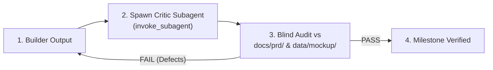

# Gauntlet Loop Skill: High-Assurance Critic Gate

Opt-in adversarial verification loop for critical milestones, UI fidelity, and security benchmarks.
Derived from Matt Shumer's Gauntlet pattern (`robonuggets/gauntlet-loop` & `duolahypercho/gauntlet-loop`).

---

## 🔁 Builder-Critic Protocol (`/gauntlet` or `/gauntlet-loop`)

---

## 🎯 Verification Steps

1. **Establish Quality Bar**: Target spec in `docs/prd/prd.md` or mockup in `data/mockup/`.
2. **Spawn Critic Subagent**: Run `invoke_subagent` with clean context to evaluate output without bias.
3. **Adversarial Audit**: Critic verifies terminal proofs (`screenshots/` or `tests/`) against the bar.
4. **Loop & Converge**: If defects found, execute fix (`f`) and re-evaluate until unanimous approval.
