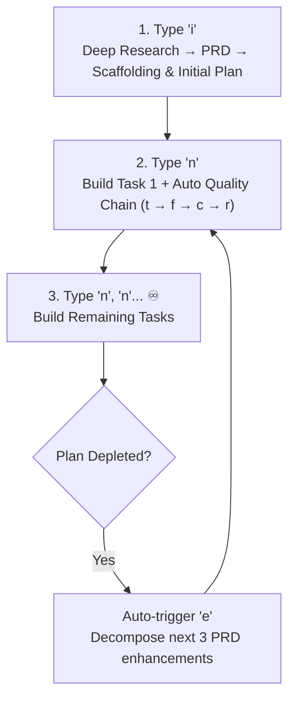

# Autonomous Coding Agents: The `inex` Method

> **Build and evolve any software application indefinitely with just two keystrokes: type `i`, then type `n`, `n`, `n`, `n`... ♾️**
> 
> 🎯 **Ephemeral Steering**: Type `focus: <direction>` (or edit [`plans/focus.md`](plans/focus.md)) to pivot for 1 batch. The agent auto-returns to the PRD roadmap once done. Type `focus: reset` or `unfocus` to cancel anytime.

---

## ⚡ The Infinite Evolution Flywheel (`i` → `n, n, n... ♾️`)




---

## ⌨️ Command Cheat-Sheet

| Command | Action | Description |
|:---|:---|:---|
| **`i` / `init`** | **Define** | Ingest research, scan codebase, or grill requirements into `docs/deep-research/`, then author PRD in `docs/prd/`. |
| **`n` / `next`** | **Build & Evolve** | Implement top `[TODO]` task. Auto-runs `e` when plan is empty! |
| **`n{x}`** (e.g. `n3`) | **Batch Build** | Execute multiple enhancement cycles sequentially in a single turn. |
| **`e` / `enhance`** | **Plan** | Decompose PRD into exactly 3 new enhancement tasks per module. |
| **`focus: <direction>`** | **Steer & Drive** | Ephemeral 1-batch focus pivot. Auto-returns to PRD roadmap upon completion. |
| **`focus: reset`** | **Clear Focus** | Cancel active focus and return immediately to standard PRD roadmap. |
| **`{x}`** (`r/m/t/f/c/d`) | **Xtend (auto)** | Auto quality gates (`t/f/c/r`) after build, plus manual Milestone (`m`) and Deploy (`d`). |
| **`/loop <interval>`** | **Periodic Loop** | Loop `n` every `x` minutes (e.g. `/loop 5m`, `/loop 10m max=6`). |

---

## 🚀 3 Ways to Run `n` (Next)

1. **Interactive Manual (`n` / `n{x}`)**:
   - Type `n` for a single task, or `n3` / `n5` to batch-execute multiple tasks sequentially.
2. **Periodic Interval Loop (`/loop <interval>`)**:
   - Loop `n` every `x` minutes with auto-replanning and quality gates:
   ```text
   /loop 5m              # Loop every 5 minutes indefinitely
   /loop 10m max=6       # Loop every 10 minutes, cap at 6 iterations
   ```
3. **Autonomous Goal & Cron (`/goal` & `/schedule`)**:
   - **Continuous Goal**: `/goal Run inex continuous evolution loop until milestone Phase 1 is done`
   - **Scheduled Cron**: `/schedule CronExpression="0 9 * * *" Prompt="Execute the next enhancement task (trigger 'n')"`


---


## 🧭 Repository Links

* 📜 **[AGENTS.md](AGENTS.md)**: Authoritative agent instructions & 6-stage lifecycle contract.
* 📦 **[`docs/integrations/submodule.md`](docs/integrations/submodule.md)**: Git Submodule Integration & Host `AGENTS.md` template.
* 🛠️ **[`skills/`](skills/README.md)**: Reusable senior engineering skills (TDD, Debug, Audit, Release).
* 🏛️ **[`docs/features/core/architecture.md`](docs/features/core/architecture.md)**: Detailed Flywheel architecture & user decisions.
* 📋 **[`plans/next-enhancements.md`](plans/next-enhancements.md)**: Active enhancement task list.
* 🎯 **[`plans/focus.md`](plans/focus.md)**: Live user focus directives & priority steering.
* 🐛 **[`issues/`](issues/)**: Numbered blocking issues & root cause reports (`issues/001-<topic>.md`).
* 🚀 **[`docs/vibe/`](docs/vibe/)**: Guides for Antigravity, Cursor, Copilot, VS Code, OpenHands, Aider.

## 🛠️ Key Governance Rules

* **Live User Focus**: Users can direct or interrupt the AI at any time by recording `[FOCUS]` directives in `plans/focus.md`, which take precedence over standard PRD queues.

* **Research-to-PRD Pipeline**: Suggest starting with deep research tools, saving to `docs/deep-research/`, and authoring PRDs in `docs/prd/` before implementation.
* **Folder & Sub-Folder Structure**: Organize into domain sub-folders with short, concise file names (e.g., `docs/features/core/architecture.md`, `services/auth/token.ts`) rather than flat, long-named files.
* **Relative Paths Only**: Strictly use relative paths across all plans, documentation, and code.
* **High-Signal Output (`i-have-adhd` Standard)**: Zero fluff, no pleasantries, lists capped at 5 items, and clean 2-liner outputs ending with the exact next keystroke (`👉 Next: Type 'n'`).
* **User Decision Immutability**: All `[DECISION]` tags are authoritative and must never be altered without explicit confirmation.


* **Demo / Live Switcher**: Separate mockup data in `data/mockup/` and provide a switcher in the UI.
* **Cloud vs Local Switcher**: Support both remote cloud APIs and on-premise/self-hosted backends.


---

## 📄 License

This project is licensed under the MIT License - see the [LICENSE](LICENSE) file for details.


