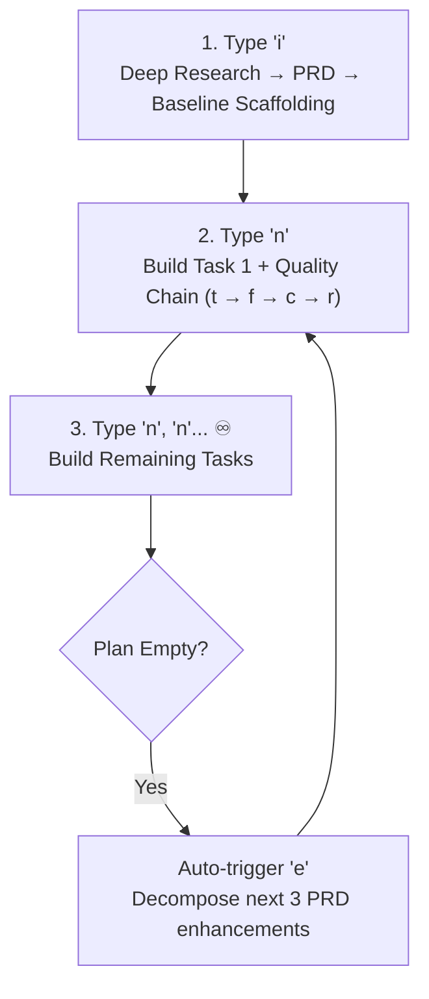

# Autonomous Coding Agents: The `inex` Method

> **Infinite App Evolution**: Type `i`, then `n`, `n`, `n`... ♾️
> **Steering**: `focus: <dir>` (or edit [`plans/focus.md`](plans/focus.md)) to pivot 1 batch. Agent auto-resumes PRD roadmap. `focus: reset` cancels.

---

## ⚡ Infinite Evolution Flywheel (`i` → `n, n, n... ♾️`)

---

## ⌨️ Command Cheat-Sheet

| Command | Action | Directive |
|:---|:---|:---|
| **`i` / `init`** | **Define** | Ingest research/grill into `docs/deep-research/`; author PRD in `docs/prd/`. |
| **`n` / `next`** | **Build & Evolve** | Implement top `[TODO]`. Auto-runs `e` when plan empty. |
| **`n{x}`** (e.g. `n3`) | **Batch Build** | Run `{x}` enhancement cycles sequentially in 1 turn. |
| **`e` / `enhance`** | **Plan** | Decompose PRD into 3 tasks/module in `plans/next-enhancements.md`. |
| **`focus: <dir>`** | **Steer** | 1-batch focus override. Auto-returns to PRD roadmap when done. |
| **`focus: reset`** | **Clear** | Cancel focus; restore PRD roadmap. |
| **`{x}`** (`r/m/t/f/c/d`) | **Xtend (auto)** | Auto gates (`t/f/c/r`) after build + manual Milestone (`m`) & Deploy (`d`). |
| **`/loop <interval>`** | **Periodic Loop** | Loop `n` every `x` min (`/loop 5m`, `/loop 10m max=6`). |

---

## 🚀 Execution Modes

* **Interactive Manual**: `n` (single task) or `n3` / `n5` (batch).
* **Interval Loop**: `/loop 5m` (infinite) or `/loop 10m max=6` (capped).
* **Goal & Schedule**: `/goal Run inex continuous loop until Phase 1 done` / `/schedule CronExpression="0 9 * * *" Prompt="trigger 'n'"`

---

## 🧭 Repository Links & Governance

* 📜 **[AGENTS.md](AGENTS.md)**: Agent instructions, submodule rules & 6-stage lifecycle contract.
* 📦 **[`docs/integrations/submodule.md`](docs/integrations/submodule.md)**: Submodule integration & host `AGENTS.md` template.
* 🛠️ **[`skills/`](skills/README.md)**: Engineering skills (TDD, Debug, Audit, Release).
* 🏛️ **[`docs/features/core/architecture.md`](docs/features/core/architecture.md)**: Architecture & decisions.
* 📋 **[`plans/next-enhancements.md`](plans/next-enhancements.md)**: Active enhancement tasks.
* 🎯 **[`plans/focus.md`](plans/focus.md)**: Priority steering.
* 🐛 **[`issues/`](issues/)**: Blockers (`issues/001-<topic>.md`).
* 🧪 **[`tests/`](tests/)** & 📸 **[`screenshots/`](screenshots/)**: Test suites & step screenshots.
* 🚀 **[`docs/vibe/`](docs/vibe/)**: Guides for Antigravity, Cursor, Copilot, VS Code, OpenHands, Aider.

---

## 📄 License

MIT - see [LICENSE](LICENSE).


