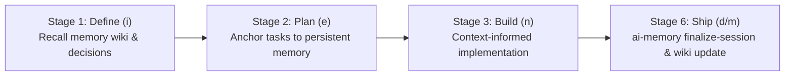

# Deep Research: ai-memory Integration

> **Target**: `https://github.com/akitaonrails/ai-memory.git`  
> **Directive**: Ingest research; map to 6-stage inex lifecycle; define immutable memory runner & wiki engine.

---

## 1. Upstream Architecture & Capabilities

- **Core Role**: Persistent long-term memory wiki and cross-agent handoff engine for AI coding agents (Antigravity CLI, Claude Code, OpenAI Codex, OpenCode, Cursor, etc.).
- **Storage Model**: Git-versioned Markdown files indexed in SQLite with Full-Text Search (FTS5), entity-assisted lexical RRF, and graph-neighbor recall.
- **Marker Configuration**: `.ai-memory.toml` defines workspace identity, project scoping, and capture exclusions.
- **Cross-Agent Handoffs**: Automatically serializes context, uncompleted tasks, and architectural decisions across agent switches.
- **Antigravity CLI Integration**: Supports MCP server and lifecycle hook bridges (`PreInvocation`, `PostInvocation`, `finalize-session`).

---

## 2. inex Lifecycle Alignment

- **Stage 1 (Define: `i` / `init`)**: Query memory wiki for architectural decisions, gotchas, and past context before planning.
- **Stage 3 (Build: `n`)**: Retain cross-session context without re-explaining architecture.
- **Stage 6 (Ship: `d` / `m`)**: Finalize session memory (`ai-memory finalize-session`) and record new decisions into persistent memory wiki.

---

## 3. Submodule & Execution Strategy

- **Immutability Contract**: Read-only tracking under `submodules/ai-memory/`.
- **Overlay Patches**: Modifications stored in `patches/ai-memory/`.
- **Wrapper Runner**: `scripts/ai-memory.sh` and `scripts/lib/ai-memory-engine.mjs` manage configuration, memory queries, writes, and handoff capture.
- **Configuration**: Root `.ai-memory.toml` marker declaring project scope, capture exclusions, and memory categories.
