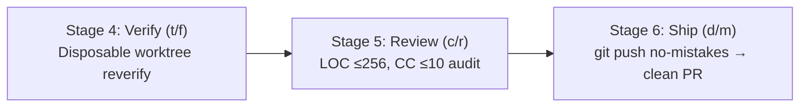

# Deep Research: no-mistakes Integration

> **Target**: `https://github.com/kunchenguid/no-mistakes.git`  
> **Directive**: Ingest research; map to 6-stage inex lifecycle; define immutable proxy wrapper.

---

## 1. Upstream Architecture & Capabilities

- **Core Role**: Local Git proxy in front of remote repository (`git push no-mistakes`).
- **Disposable Worktree**: Clones working tree to isolated temporary worktree; keeps developer active workspace intact.
- **Pre-PR Pipeline**: Sequentially executes `review` → `test` → `docs` → `lint` → `push` → `PR` → `CI`.
- **Agent-Agnostic Engine**: Supports `antigravity`, `claude`, `codex`, `grok`, `rovodev`, `opencode`, `cursor`, etc., with cascading fallbacks.
- **Tiered Fixes**: Automatically applies mechanical auto-fixes (formatting, linter autofix, reverify); escalates architectural/logic issues to human or ledger.

---

## 2. inex Lifecycle Alignment

- **Stage 4 (`t` / `f`)**: Verification runner executes inside disposable worktree for zero pollution.
- **Stage 5 (`c` / `r`)**: Gate linting (`gate-lint.mjs`) & complexity audit run as pipeline stages.
- **Stage 6 (`d` / `m`)**: Pre-push proxy gate intercepts remote push; creates clean PR only when green.

---

## 3. Submodule & Execution Strategy

- **Immutability Contract**: Read-only tracking under `submodules/no-mistakes/` (or git submodule).
- **Overlay Patches**: Modifications stored in `patches/no-mistakes/`.
- **Wrapper Runner**: `scripts/no-mistakes.sh` manages binary acquisition, fallback compilation, and proxy hooks.
- **Configuration**: Root `.no-mistakes.yaml` declares agent order, test runners, and unlazy gate checks.
