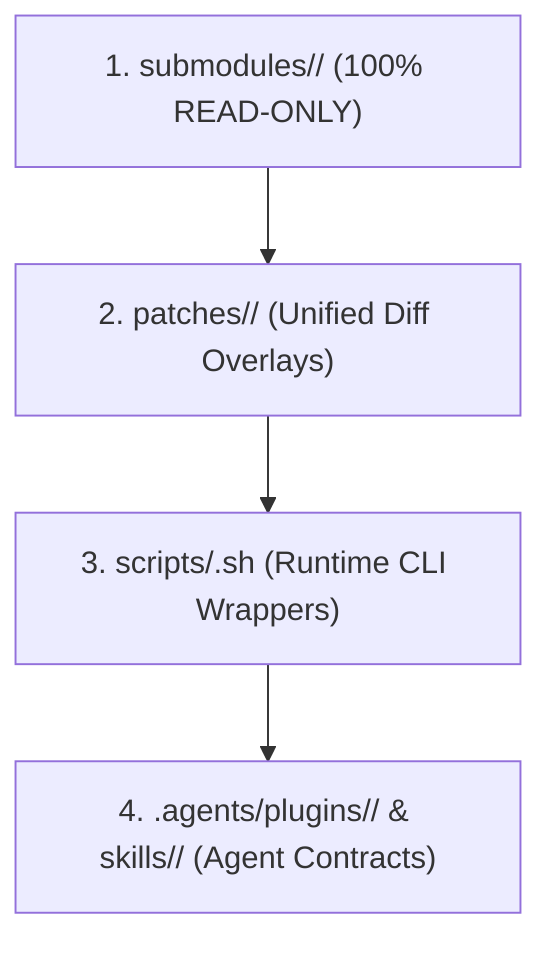

# Deep Research: Full Submodule Architecture Expansion

> **Directive**: Ingest research for tracking all 9 engineering skills as 100% read-only Git submodules.

---

## 1. Submodule Inventory & Upstream Mappings

| Skill / Plugin | Upstream Repository | Role & Purpose |
|:---|:---|:---|
| `ai-memory` | `https://github.com/akitaonrails/ai-memory.git` | Persistent long-term memory & cross-agent handoffs |
| `archify` | `https://github.com/tt-a1i/archify.git` | Verifiable visual technical diagrams & architecture maps |
| `caveman` | `https://github.com/JuliusBrussee/caveman.git` | Extreme token compression & telegraphic brevity |
| `gauntlet-loop` | `https://github.com/robonuggets/gauntlet-loop.git` | Builder-critic adversarial verification loop |
| `graphify` | `https://github.com/Graphify-Labs/graphify.git` | Codebase AST knowledge graph & dependency queries |
| `how` | `https://github.com/poteto/how.git` | Architectural explanation & rapid orientation |
| `no-mistakes` | `https://github.com/kunchenguid/no-mistakes.git` | Pre-PR quality gate & disposable worktree proxy |
| `ponytail` | `https://github.com/DietrichGebert/ponytail.git` | Lazy Senior Developer decision ladder & anti-overengineering |
| `unlazy` | `https://github.com/Leonxlnx/unlazy.git` | Acceptance gates, depth-tree decomposition & completion discipline |

---

## 2. Immutability & Three-Tiered Overlay Architecture

1. **`submodules/<name>/`**: Upstream repositories pinned and tracked via `.gitmodules`. Zero manual mutations.
2. **`patches/<name>/`**: Repository-specific customizations and adaptations stored as clean patches.
3. **`scripts/`**: Centralized runtime runners dynamically injecting configurations and managing execution.
4. **`.agents/plugins/` & `skills/`**: Standardized plugin and skill manifests exposing interfaces to AI coding agents.
