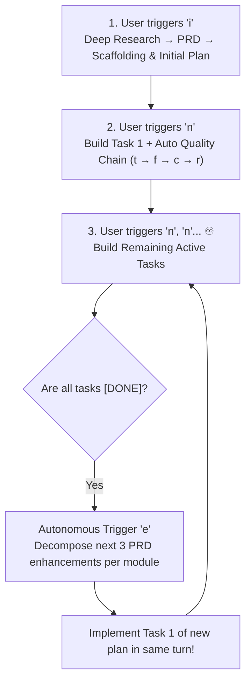

# Core Architecture & User Decisions

This document records the foundational architectural features and permanent user decisions governing the platform.

---

## 🏛️ Key Architectural Decisions

None yet. 

---

## ⚡ The Infinite Evolution Flywheel (`i` → `n, n, n... ♾️`)

The platform's core operating engine is designed around a self-propelling autonomous evolution loop:

### Key Capabilities of the Flywheel:
1. **Zero Backlog Overhead**: Developers do not need to manually write, manage, or prioritize ticket backlogs.
2. **Autonomous Plan Generation on Depletion**: When `plans/next-enhancements.md` runs out of tasks, triggering `n` automatically executes `e` ([`skills/task-decomposition/`](skills/task-decomposition/SKILL.md)) to author 3 new deeper enhancements anchored in [`docs/prd/`](docs/prd/).
3. **Continuous Senior Quality Gates**: Every execution autonomously enforces `t` (tests), `f` (bug triage), `c` (256 LOC modular refactoring), and `r` (PRD and user decision audit).

### 3 Execution Tiers for the Flywheel:
1. **Interactive Manual (`n` / `n{x}`)**: The developer types `n` to step through single tasks, or `n3`/`n5` for batch task runs.
2. **Autonomous Goal Loop (`/goal`)**: The agent runs in a continuous loop, executing tasks, auto-replanning on depletion, and verifying quality until a target milestone is reached.
3. **Scheduled Automation (`/schedule`)**: Background timers or cron jobs that trigger `n` at scheduled intervals (e.g. daily builds or hourly refactors).

---

## 📦 Core Feature Capabilities

### 1. Agent Workflow Engine
- Support for rapid enhancement loops via `e` and `n`/`n{x}`.
- Automated generation of 3 enhancements per section in `plans/next-enhancements.md`.
- Structured milestone execution across phase plans in `plans/roadmaps/<epic>/<phase>.md`.

### 2. Multi-Environment & Mock Services
- Mock API abstraction layer isolating mock payloads in `data/mockup/`.
- UI switcher controls for seamless switching between Demo and Live data.

