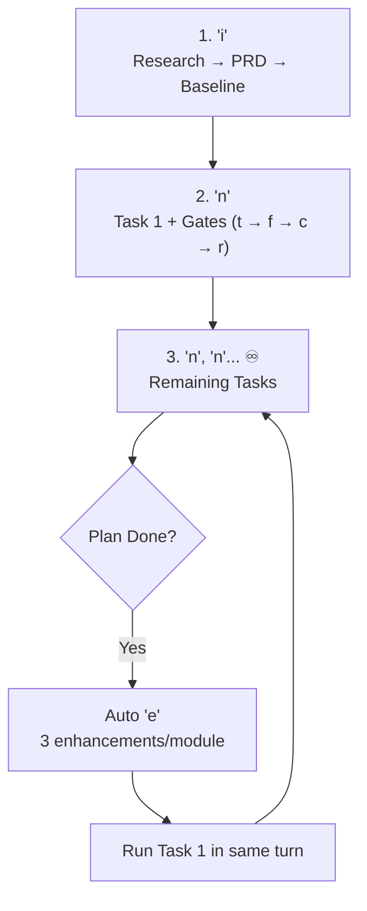

# Core Architecture & User Decisions

## Architectural Decisions
* `[DECISION]` Autonomous evolution engine driven by `inex` lifecycle.

## Infinite Evolution Flywheel (`i` → `n, n, n... ♾️`)

## Flywheel Capabilities
1. **Zero Backlog Overhead**: No manual ticketing.
2. **Auto-Replanning**: Empty `plans/next-enhancements.md` auto-runs `e` (`skills/task-decomposition/`).
3. **Quality Gates**: Every `n` runs `t` (test), `f` (fix), `c` (≤256 LOC split), `r` (audit).

## Execution Tiers
1. **Manual**: `n` / `n{x}`.
2. **Goal Loop**: `/goal` continuous milestone run.
3. **Scheduled**: `/schedule` cron/timer trigger.

## Feature Modules
* **Workflow Engine**: `e` + `n` loops, 3 tasks/section, `plans/roadmaps/` phases.
* **Mock & Multi-Env**: Mock API via `data/mockup/`, UI Demo/Live switcher, Cloud/Local switcher.

